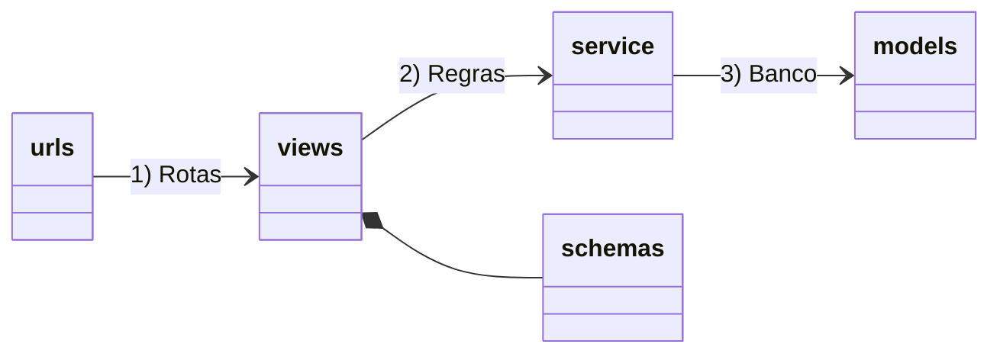

# 💒 Casamentobiaetainan.com.br

### Organização das camadas

Visao geral

```shell
anaetainan                       👉 Pasta raiz do projeto
 ├── README.md
 ├── manage.py                   👉 Django CLI (Ponto de entrada)
 ├── requirements.txt            👉 Dependencias principais
 ├── requirements-dev.txt        👉 Dependencias locais (pode mudar no modo Poetry)
 ├── docker-compose.yml          👉 Descritor docker para rodar local
 ├── Dockerfile                  👉 Receita para rodar projeto
 ├── tox.ini
 ├── uwsgi.ini
 └── anaetainan                  👉 base do projeto
    ├── base                     👉 app para regras fora do "core"
    │   └── ...
    ├── accounts                 👉 app relacionado a usuarios e autenticacao
    │   └── ...
    ├── core                     👉 app principal com o "core business" 
    │   └── ...
    ├── commons/
    ├── fornecedores/            👉 App de fornecedores (bolo, doces, restaurante...)
    ├── fotos/                   👉 App fotos da home
    ├── listapresentes/          👉 App da lista de presentes
    ├── roteiros/                👉 Roteiro 
    ├── rsvp/                    👉 Confirmação da lista de convidados
    ├── themes/                  👉 Frontend com o CSS frameworks
    └── anaetainan               👉 centraliza configuracoes do projeto
        ├── api.py
        ├── settings.py          👉 Configuracoes principal do Django
        ├── urls.py              👉 Configuracao principal das rotas no Django
        └── wsgi.py
```

O Django tem o conceito de "apps" com a ideia de separar os contextos do seu projeto, ao invés de ter tudo na app principal, podemos ir criando novas apps como por exemplo, vendas, compras, estoque, relatórios, blog de forma a agrupar funcionalidades da mesma natureza. Cada app segue a estrutura abaixo: 



## Rodando o projeto

## Requisitos

- Git
- 🐍 Python 3.9.x ou 3.11.x (para utilizar Poetry)
- Um terminal (de preferência um terminal Linux, é para funcionar em um terminal WSL no Windows)

Temos três formas para **Rodar** 🍨:
- Sem Docker 📦: Apenas **Python** (usando sqlite)
- Apenas Banco de dados usando 🐋 Docker (melhor para debug)
- Tudo usando Docker 🐋: **Docker** and **Docker compose** (tudo rodando com um comando)

Links:
- Para entender [rodar com ou sem docker](https://www.djavue.org/README_EN.html#%F0%9F%90%8B-run-locally-using-docker-vs-not-using-docker-containers)
- [Para rodar tudo com docker](https://www.djavue.org/README_EN.html#%F0%9F%90%8B-running-all-with-docker)
- [Para rodar sem docker](https://www.djavue.org/README_EN.html#%F0%9F%93%A6-running-the-%F0%9F%A6%84-backend-without-docker)
- [Rodando com Poetry](https://www.djavue.org/README_EN.html#%F0%9F%93%A6-package-management-with-poetry)


## Instalacao Local

```bash
git clone git@github.com:tainanjose/casamento_tainan_ana.git
cd casamento_tainan_ana/
python -m venv .venv
source .venv/bin/activate
pip install -r requirements-dev.txt 
```
